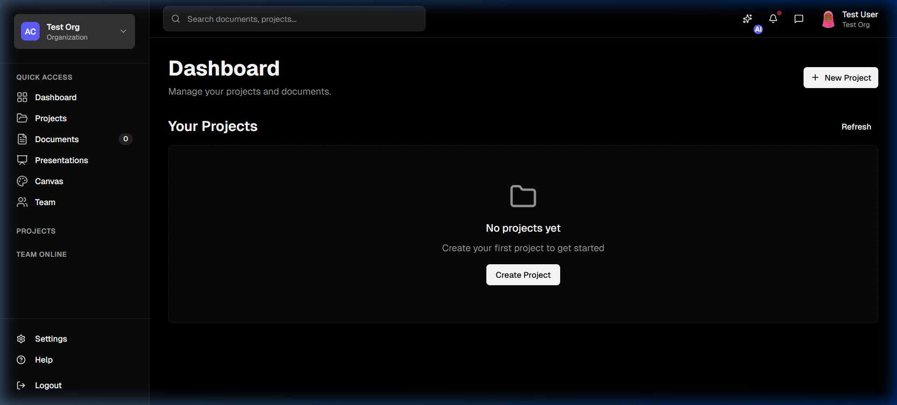
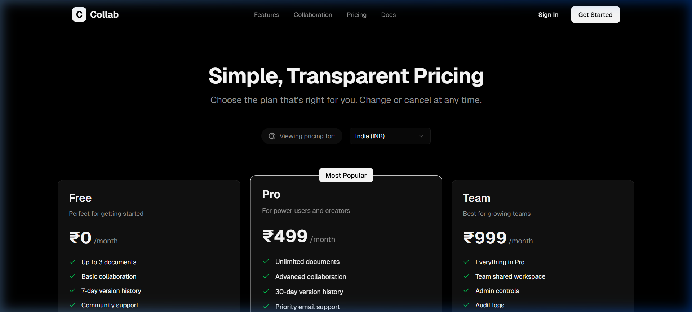

# Real-Time Collaborative Document Editor with AI Assistance

A powerful, real-time collaboration platform designed for seamless document editing, enriched with AI-assisted content generation. Built on a modern microservices architecture, it solves the problem of disconnected workflows by merging live multi-user synchronization, intelligent AI writing tools, and team organization into a single cohesive workspace.

**Live Deployment:** *[Insert Production URL Here]*

## Technology Stack

| Layer | Technologies |
|---|---|
| **Frontend** | Next.js, React, Tailwind CSS, Lucide Icons, Socket.io-client |
| **Backend & APIs** | Node.js, Express, Socket.io, Yjs (CRDTs) |
| **AI Service** | Python, FastAPI, Google Generative AI (Gemini) SDK |
| **Database & ORM** | PostgreSQL, Prisma |
| **Authentication** | Custom JWT-based authentication |
| **Hosting & Deployment**| Vercel (Frontend), Render (Backend Services and Database) |

## System Architecture


Our distributed architecture routes all client communication through a central API Gateway into specialized microservices, isolating concerns such as real-time sync (Yjs + WebSockets), authentication, document storage, and AI processing.

## Key Features

- **Real-Time Collaboration:** Sub-millisecond latent document synchronization powered by WebSockets and CRDTs.
- **AI-Powered Assistance:** Context-aware text generation, summarization, and autocomplete using Google Gemini.
- **Secure Workspace Management:** Role-based access control inside Organizations and Projects.
- **Robust Persistence:** Immutable document version histories backing up real-time memory states.
- **Scalable Infrastructure:** Microservices deployment ensuring single points of failure do not cascade.

## Visual Tour

| Home Dashboard | Editor Interface | Payment Gateway |
|---|---|---|
|  |  |  | 

*(Note: Add screenshot files to `docs/images/` to render successfully)*

## Quick Start

### Prerequisites
- Node.js (v18+)
- Python (3.9+)
- PostgreSQL Database URL
- Google Gemini API Key

### Getting Started

1. **Clone the repository:**
   ```bash
   git clone <repo-url>
   cd Realtime_Collaborator
   ```

2. **Backend Setup:**
   Initialize databases and start the Node.js services.
   ```bash
   cd services/
   # Provide your DB string in .env fields matching .env.example files
   npx prisma db push # in Node.js service containing prisma 
   npm run dev
   ```

3. **AI Service Setup:**
   Run the FastAPI Python service.
   ```bash
   cd services/ai-service
   pip install -r requirements.txt
   # Ensure GEMINI_API_KEY is defined in .env
   python src/main.py
   ```

4. **Frontend Setup:**
   Start the Next.js web application.
   ```bash
   cd apps/web
   npm install
   npm run dev
   ```
   Navigate to `http://localhost:3000` to preview.

## Folder Structure

The repository is structured as a monorepo managing independent services and shared packages:

```
Realtime_Collaborator/
├── apps/               # Contains user-facing applications
│   └── web/            # Next.js Frontend
├── services/           # The backend microservices cluster
│   ├── api-gateway/    # Central router & proxy middleware
│   ├── auth-service/   # JWT Authentication logic
│   ├── collab-service/ # Socket.io and Yjs synchronization
│   ├── document-service/# Metadata and version snapping
│   ├── organization-service/  # Tenant and billing logic
│   └── ai-service/     # Python FastAPI Gemini integration
├── packages/           # Shared libraries
│   ├── database/       # Prisma Schema and migrations
│   ├── logger/         # Global logging utilities
│   └── types/          # Shared TypeScript definitions
└── docs/               # Engineering documentation
```

## Environment Variables

To run the full stack, you need to populate `.env` files in each respective directory based on their `.env.example`.
- `DATABASE_URL`: PostgreSQL connection string (used in Org, Auth, Doc services).
- `JWT_SECRET`: Secure encryption key for issuing and validating tokens.
- `GEMINI_API_KEY`: Required by the Python AI Service.
- `NEXT_PUBLIC_API_URL`: Root path for API Gateway mapped in `apps/web`.
- `STRIPE_SECRET_KEY`: Used within the Organization service for billing pipelines.

## Deployment Status

This project utilizes a cloud-native footprint. The frontend is hosted globally via edge networks (Vercel), while the backend API Gateway and specialized microservices are deployed via Dockerized environments or native execution environments on Render. The PostgreSQL database resides on a managed Render instance ensuring automated backups and high availability.

## Future Roadmap

- **Stripe Billing Integration Pipeline:** Completing frontend checkout sessions connected directly to the existing organization billing tables.
- **Offline First Editing:** Utilizing IndexedDB to persist local Yjs changes while offline, merging gracefully upon internet reconnection.
- **Rich Text AI:** Advancing the AI service to format blocks, headings, and lists implicitly without raw text dumps.

## Impact Statement

*Realtime_Collaborator* pushes the boundary of modern SaaS architectures by blending bleeding-edge AI tooling with complex conflict-free peer-to-peer data syncing. This repository stands as a production-grade template demonstrating scalable state management, robust API gateway routing, and AI integration for high-performance productivity tools.
