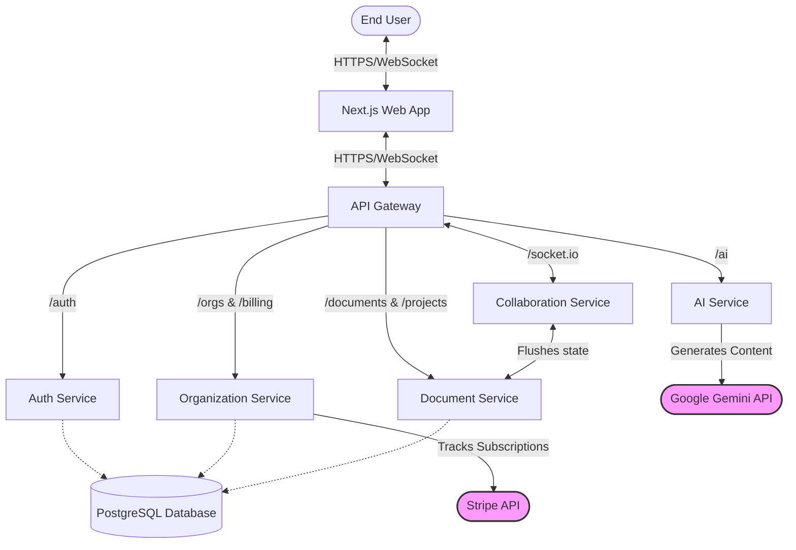

# System Architecture

The Realtime_Collaborator platform is built on an API-Gateway-driven microservices architecture. This structure ensures isolation of responsibilities, improved scalability, targeted tech stacks for respective jobs (Node.js vs Python), and resilient fault boundaries.

## Component Breakdown

1. **Frontend (Next.js Application)**
   - Responsible for state management, local CRDT representations (Yjs), and rendering the user interface. Connects to backend services entirely through the API Gateway, utilizing HTTP for standard resource operations and WebSockets for real-time collaboration.

2. **API Gateway (Node.js/Express)**
   - Acts as the single point of entry into the application cluster.
   - Provides HTTP proxying to all downstream components and upgrades WebSocket connections for `collab-service`.
   - Normalizes CORS behavior and implements global request logging and health tracking.

3. **Auth Service (Node.js/Express)**
   - Manages encrypted user credentials (`password_hash`), registration, login flow, and JWT (JSON Web Token) creation/validation. Assumes domain authority over the `User` database tables.

4. **Organization Service (Node.js/Express)**
   - Serves as the tenant isolation layer. Manages Organizations, Team memberships, and underlying ties to user access levels. Contains Stripe abstractions and billing configurations.

5. **Document Service (Node.js/Express)**
   - Central authority over textual and metadata resources including Projects, Documents, Canvases, and Slides. Persists Yjs binary blobs as history snapshots preventing data loss from ephemeral memory in the collaboration service.

6. **Collaboration Service (Node.js/Socket.io/Yjs)**
   - A highly concurrent Node instance focused strictly on peer-to-peer CRDT updates and user presence (cursors/awareness). It communicates frequently with `document-service` to flush merged document changes into the database.

7. **AI Service (Python/FastAPI)**
   - Specialized environment for Natural Language Processing tasks leveraging the Google Generative AI (Gemini) SDK. Integrates directly into the editor context to synthesize real-time user prompts with contextual blocks of the document.

8. **Database Layer (PostgreSQL/Prisma)**
   - Centralized relational database, utilizing Prisma ORM across Node.js services acting as the singular source of truth for durable states. 

9. **Stripe (External Integration)**
   - Facilitates the payment infrastructure. Managed primarily via the Organization Service to maintain subscription ties logically coupled with the tenant object.

## Ecosystem Routing & Data Flow

## Real-Time Collaboration Flow

1. **Initialization:** The user enters a document URL, the client fetches the latest Yjs binary blob from the `document-service` through the Gateway.
2. **WebSocket Handshake:** A WebSocket connection is established with the `collab-service`.
3. **Syncing Updates:** When a user types a character, a Yjs differential update vector is formed locally and transmitted via WebSockets to `collab-service`.
4. **Broadcasting:** The `collab-service` broadcast this delta to all other subscribed clients in the room to process the CRDT merge. 
5. **Persistence Trigger:** Periodic debounced processes trigger `collab-service` to commit the fully merged Yjs binary state back to the `document-service` to store in PostgreSQL.
