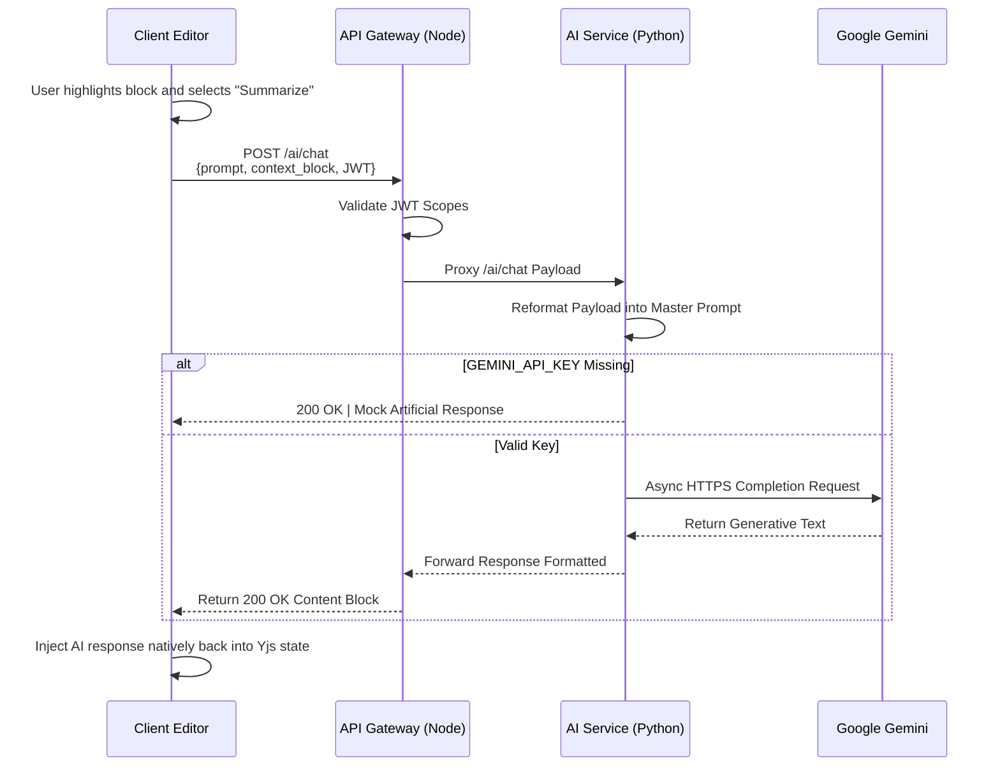

```mermaid
sequenceDiagram
    participant UA as Client Editor
    participant GW as API Gateway (Node)
    participant AI as AI Service (Python)
    participant GEM as Google Gemini

    UA->>UA: User highlights block and selects "Summarize"
    UA->>GW: POST /ai/chat <br>{prompt, context_block, JWT}
    
    %% API Gateway Layer
    GW->>GW: Validate JWT Scopes
    GW->>AI: Proxy /ai/chat Payload
    
    %% Python Service
    AI->>AI: Reformat Payload into Master Prompt
    
    %% Conditional Branching
    alt GEMINI_API_KEY Missing
        AI-->>UA: 200 OK | Mock Artificial Response
    else Valid Key
        AI->>GEM: Async HTTPS Completion Request
        GEM-->>AI: Return Generative Text
        AI-->>GW: Forward Response Formatted
        GW-->>UA: Return 200 OK Content Block
    end
    
    UA->>UA: Inject AI response natively back into Yjs state
```
