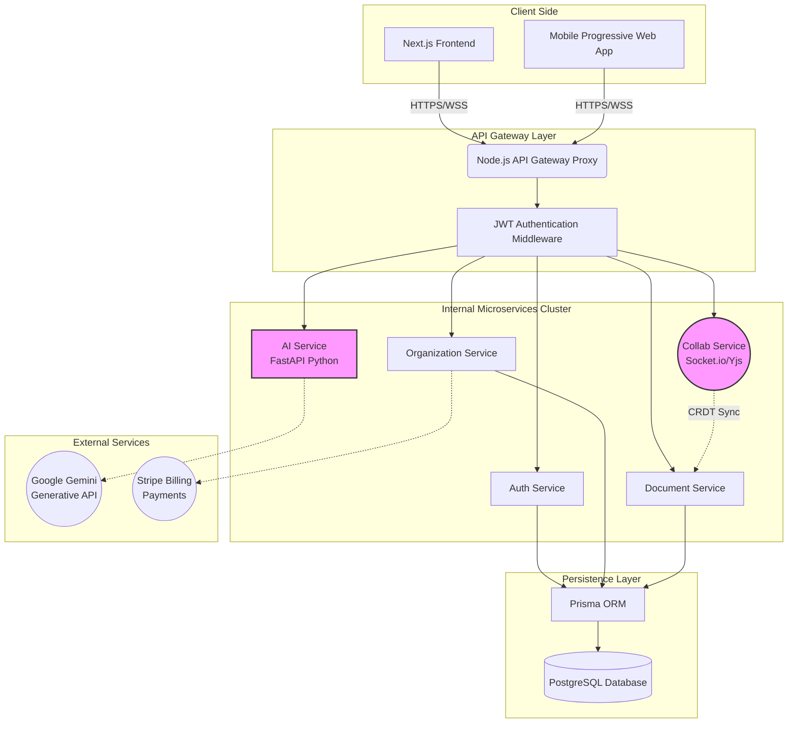

```mermaid
graph TD
    %% Define boundaries
    subgraph Client [Client Side]
        Browser[Next.js Frontend]
        Mobile[Mobile Progressive Web App]
    end

    %% API Gateway Layer
    subgraph Gateway [API Gateway Layer]
        APIGateway(Node.js API Gateway Proxy)
        AuthMW[JWT Authentication Middleware]
    end

    %% Internal Microservices Cluster
    subgraph Backend Services [Internal Microservices Cluster]
        AuthService[Auth Service]
        OrgService[Organization Service]
        DocService[Document Service]
        CollabService((Collab Service<br>Socket.io/Yjs))
        AIService[AI Service<br>FastAPI Python]
    end

    %% External Systems & Storage
    subgraph Storage [Persistence Layer]
        DB[(PostgreSQL Database)]
        Prisma[Prisma ORM]
    end
    
    subgraph External [External Services]
        Gemini((Google Gemini<br>Generative API))
        Stripe((Stripe Billing<br>Payments))
    end

    %% Relationships and Data flow
    Browser & Mobile --HTTPS/WSS--> APIGateway
    
    APIGateway --> AuthMW
    AuthMW --> AuthService
    AuthMW --> OrgService
    AuthMW --> DocService
    AuthMW --> CollabService
    AuthMW --> AIService
    
    CollabService -.CRDT Sync.-> DocService
    
    OrgService -.-> Stripe
    AIService -.-> Gemini
    
    AuthService & OrgService & DocService --> Prisma
    Prisma --> DB
    
    %% Styling
    classDef primary fill:#f9f,stroke:#333,stroke-width:2px;
    class CollabService,AIService primary;
```
