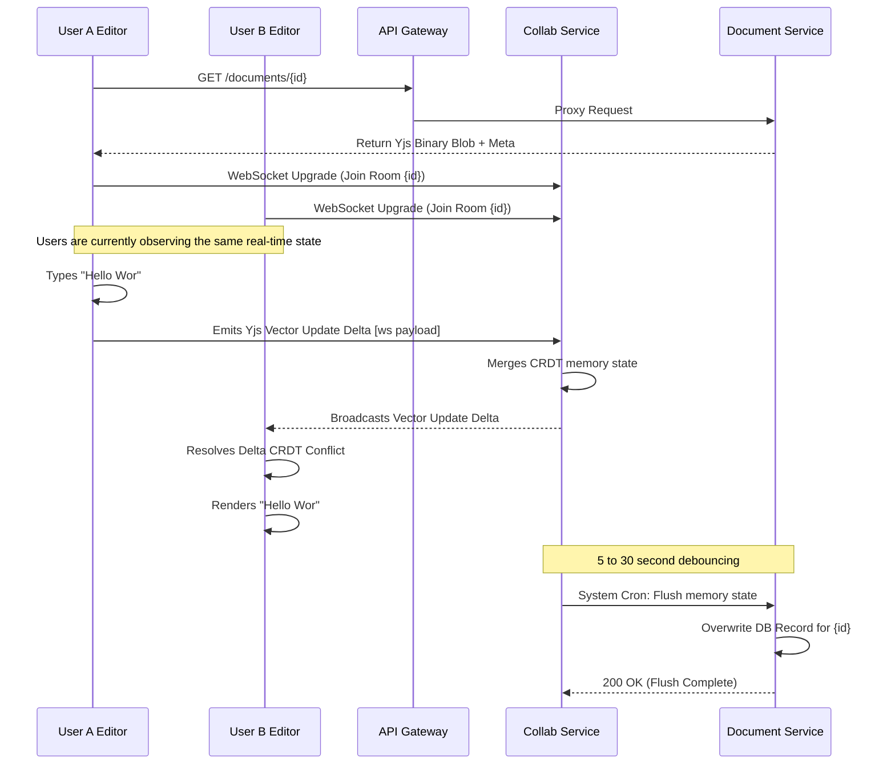

```mermaid
sequenceDiagram
    participant UA as User A Editor
    participant UB as User B Editor
    participant GW as API Gateway
    participant CS as Collab Service
    participant DS as Document Service

    %% Initialization Stage
    UA->>GW: GET /documents/{id}
    GW->>DS: Proxy Request
    DS-->>UA: Return Yjs Binary Blob + Meta
    UA->>CS: WebSocket Upgrade (Join Room {id})
    UB->>CS: WebSocket Upgrade (Join Room {id})
    
    %% Live Editing Diff
    Note over UA,UB: Users are currently observing the same real-time state
    UA->>UA: Types "Hello Wor"
    UA->>CS: Emits Yjs Vector Update Delta [ws payload]
    CS->>CS: Merges CRDT memory state
    CS-->>UB: Broadcasts Vector Update Delta
    UB->>UB: Resolves Delta CRDT Conflict
    UB->>UB: Renders "Hello Wor"
    
    %% Persistence Debounce
    Note over CS,DS: 5 to 30 second debouncing
    CS->>DS: System Cron: Flush memory state
    DS->>DS: Overwrite DB Record for {id}
    DS-->>CS: 200 OK (Flush Complete)
```
