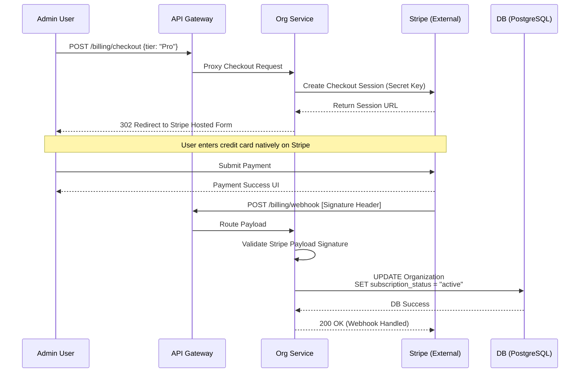

```mermaid
sequenceDiagram
    participant U as Admin User
    participant G as API Gateway
    participant O as Org Service
    participant S as Stripe (External)
    participant D as DB (PostgreSQL)

    %% Session Creation
    U->>G: POST /billing/checkout {tier: "Pro"}
    G->>O: Proxy Checkout Request
    O->>S: Create Checkout Session (Secret Key)
    S-->>O: Return Session URL
    O-->>U: 302 Redirect to Stripe Hosted Form

    %% Checkout & Webhook
    Note over U,S: User enters credit card natively on Stripe
    U->>S: Submit Payment
    S-->>U: Payment Success UI
    
    %% Async Webhook Validation
    S->>G: POST /billing/webhook [Signature Header]
    G->>O: Route Payload
    O->>O: Validate Stripe Payload Signature
    O->>D: UPDATE Organization <br> SET subscription_status = "active"
    D-->>O: DB Success
    O-->>S: 200 OK (Webhook Handled)
```
